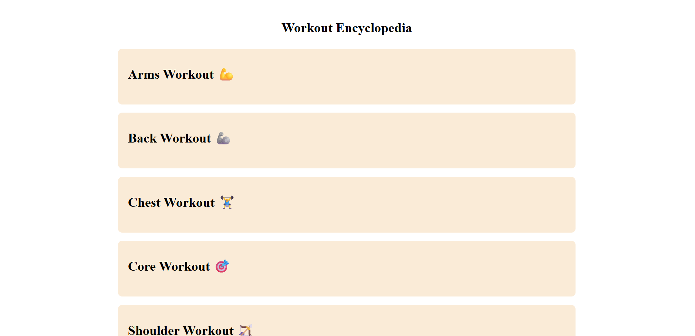
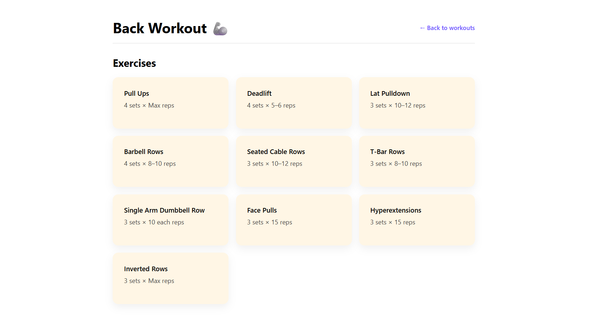
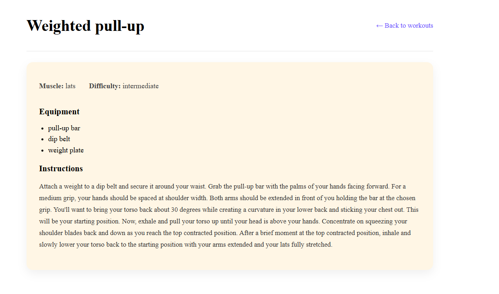

# 🏋️ Workout Encyclopedia

Workout Encyclopedia is a React-based web application that provides a categorized collection of workouts for different muscle groups. The project is built using **React.js**, **TypeScript**, and **JavaScript**, and demonstrates clean component design, state management using React Hooks, and API-based data fetching.

---

## 🚀 Features

- 📚 Categorized workouts (Arms, Back, Chest, Core, Shoulders, etc.)
- 🔄 Dynamic workout data fetched from an external API
- ⚛️ Built with React Functional Components
- 🧠 State management using `useState`
- 🌐 API handling with `useEffect`
- 📱 Clean and minimal UI design
- 🧩 Type-safe development using TypeScript

---

## 🛠️ Tech Stack

- **Frontend:** React.js
- **Language:** TypeScript & JavaScript
- **State Management:** React Hooks (`useState`, `useEffect`)
- **API:** External Workout / Exercise API
- **Styling:** CSS

---

## 📂 Project Structure

src/
├── components/
│ ├── Workout.tsx
│ ├── Exercise.tsx
│ └── Card.tsx
├── data/
│ └── workouts.ts
├── pages/
│ └── ExerciseDetails.tsx
├── styles/
│ └── styles.css
├── App.tsx
├── index.tsx
└── types/
└── exercise.ts

## ⚙️ Installation & Setup

Follow these steps to run the project locally:

```bash
# Clone the repository
git clone https://github.com/your-username/workout-encyclopedia.git

# Navigate to the project directory
cd workout-encyclopedia

# Install dependencies
npm install

# Start the development server
npm start

The app will run on:
👉 http://localhost:3000

🌐 API Usage

-> This project fetches exercise data from an external workout API.

-> Data is fetched using fetch() inside useEffect

-> Exercises are rendered dynamically based on workout category

-> TypeScript interfaces are used to ensure type safety

## 📸 Screenshots

### 🏠 Home Page



### 💪 Back Workouts



### 📋 Exercise Details




🎯 Learning Outcomes

-> Improved understanding of React Hooks

-> Hands-on experience with TypeScript in React

-> API integration and error handling

-> Component-based architecture

-> Props and state flow in React

🔮 Future Improvements

-> 🔍 Search and filter workouts

-> ❤️ Favorite workouts feature

-> 🔐 Authentication

-> 📊 Workout tracking

-> 🎨 Improved UI & animations

📄 License

This project is licensed under the MIT License.
